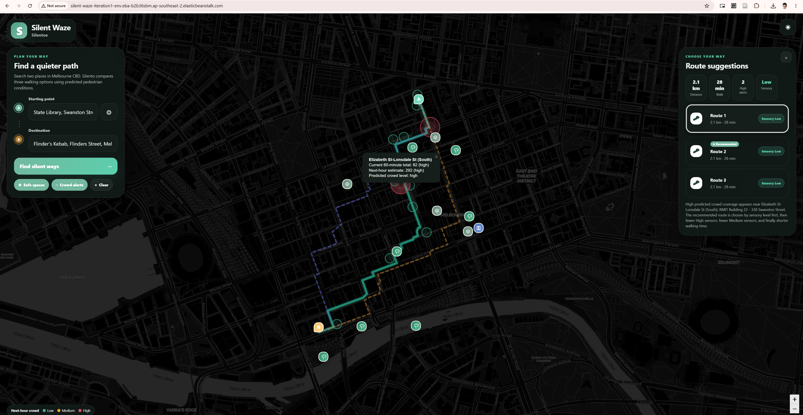
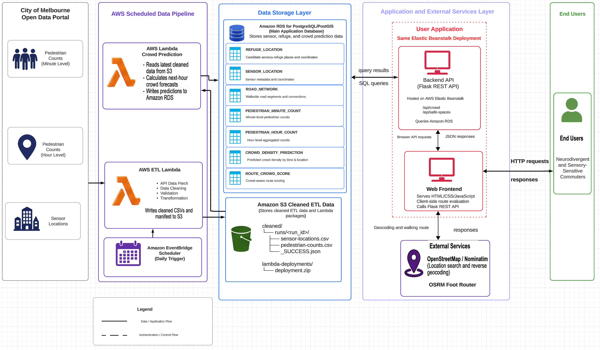

# SilentWaze — Melbourne CBD Navigation

SilentWaze is a sensory-aware walking-route application for Melbourne CBD. It compares walking alternatives using predicted pedestrian conditions and highlights routes with a lower sensory burden for neurodivergent and sensory-sensitive commuters.

## Application preview

### Light mode

### Dark mode

The web interface provides place search, multiple walking-route alternatives, predicted crowd alerts, sensory-refuge locations, and a recommended lower-burden route.

**Live application:** [Open SilentWaze on AWS Elastic Beanstalk](http://silent-waze-iteration1-env.eba-b2b36sbm.ap-southeast-2.elasticbeanstalk.com/)

## System architecture

The implemented data and application flow is:

1. Amazon EventBridge triggers the ETL Lambda on a daily schedule.
2. The ETL Lambda retrieves City of Melbourne sensor and pedestrian-count data, then cleans and validates it.
3. Cleaned CSV files and a `_SUCCESS.json` manifest are stored in Amazon S3 under `cleaned/runs/<run_id>/`.
4. The crowd-prediction Lambda reads the latest successful S3 run, calculates next-hour forecasts, and writes predictions to Amazon RDS for PostgreSQL/PostGIS.
5. The Flask REST API queries crowd predictions, sensor locations, and sensory-refuge locations from RDS.
6. The browser uses Nominatim for search and reverse geocoding, OSRM for walking alternatives, and client-side route evaluation to recommend a lower-burden route.

## Key features

- Search for a starting point and destination in Melbourne CBD.
- Compare multiple walking-route alternatives.
- Display current and next-hour pedestrian crowd information.
- Highlight high-crowd sensor coverage along routes.
- Display candidate sensory-refuge locations.
- Rank routes through client-side sensory evaluation.
- Support light and dark map interfaces.

## Repository structure

- `Silento_Silent_Ways_Final_version/` — active Flask web application and AWS Elastic Beanstalk deployment source.
- `lamdba/silento-etl/` — ETL Lambda that extracts, validates, transforms, and uploads cleaned datasets to Amazon S3.
- `Lambda_Crowd_Prediction/` — crowd-prediction Lambda that reads cleaned S3 data and writes forecasts to Amazon RDS.
- `Silento_Silent_Ways_Final_version/docs/` — README screenshots and architecture assets.

## Technology stack

- **Frontend:** HTML, CSS, JavaScript, Leaflet
- **Backend:** Python, Flask, Gunicorn
- **Database:** Amazon RDS for PostgreSQL/PostGIS
- **Data pipeline:** Amazon EventBridge, AWS Lambda, Amazon S3
- **External mapping services:** OpenStreetMap/Nominatim and OSRM Foot Router
- **Deployment:** AWS Elastic Beanstalk on Amazon Linux

## REST API endpoints

- `GET /api/crowd` — returns sensor locations and the latest available crowd predictions.
- `GET /api/safe-spaces` — returns candidate sensory-refuge locations.
- `GET /health` — returns the web application's health status.

## AWS Elastic Beanstalk deployment

The Beanstalk deployment ZIP must contain the following files and directories at the archive root, without an additional parent-directory layer:

- `application.py`
- `Silento_app.py`
- `requirements.txt`
- `static/`
- `templates/`

The Backend API and web frontend are delivered through the same Elastic Beanstalk deployment. Runtime database settings are supplied through Elastic Beanstalk environment properties.

## Current implementation notes

- The ETL Lambda writes cleaned data to Amazon S3; it does not directly load the cleaned CSV files into RDS.
- The crowd-prediction Lambda reads the latest successful S3 run and writes forecast records to `CROWD_DENSITY_PREDICTION`.
- Route geometry comes from OSRM rather than the `ROAD_NETWORK` table.
- Route evaluation currently runs in the browser and does not persist results to `ROUTE_CROWD_SCORE`.
